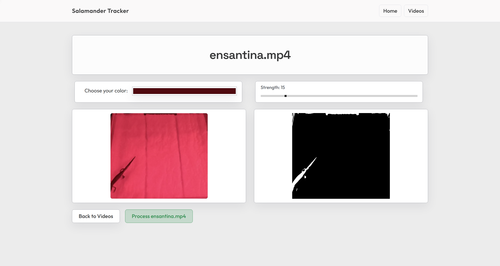

# Centroid Finder

Centroid Finder is a Java project for detecting color-based groups in images and videos, then exporting centroid results to CSV.

## What This Project Does

- Binarizes image pixels against a target color and threshold.
- Finds connected white-pixel groups.
- Computes group centroids.
- Writes results to CSV.
- Supports both image flow and video flow entry points.
- Exports a CSV for user to download on the front end.

## Libraries

- Java 17
- Maven
- JUnit 5
- JCodec / JAVE dependencies for video-related processing

## Project Structure

- src/main/java/io/github/JonusClapshaw/centroidFinder
	Main source code
- src/test/java/io/github/JonusClapshaw/centroidFinder
	Unit tests
- sampleInput
	Sample images and inputs
- sampleOutput
	Example output artifacts
- pom.xml
	Build and dependency configuration

## Run Tests

All tests:

- mvn test

Targeted examples:

- mvn -Dtest=DistanceImageBinarizerTest test
- mvn -Dtest=VideoProcessorAppTest,InputValidatorTest test

## Run Image Processing (ImageSummaryApp)

Example Command:

- mvn -q -DskipTests exec:java -Dexec.mainClass=io.github.JonusClapshaw.centroidFinder.ImageSummaryApp -Dexec.args="sampleInput/squares.jpg FFA200 164"

Output:

- binarized.png
- groups.csv

## Common Outputs

- groups.csv
	Group summaries and centroid rows
- binarized.png
	Black/white binarized image

### Data Flow (Image Path)

1. User provides image path, target color, and threshold.
2. App validates arguments and loads image pixels.
3. DistanceImageBinarizer converts pixels into a binary matrix (0 or 1).
4. DfsBinaryGroupFinder finds connected white-pixel groups.
5. Each group centroid is computed and written to groups.csv.
6. Binary matrix is rendered to binarized.png.

### Data Flow (Video Path)

1. User provides video path, output CSV path, target color, and threshold.
2. VideoFrameReader streams frames with timestamps.
3. Each sampled frame is binarized and grouped with the same core pipeline.
4. Per-frame centroid results are appended to CSV for downstream use.
5. Frontend/API layer can expose generated CSV and preview assets.

